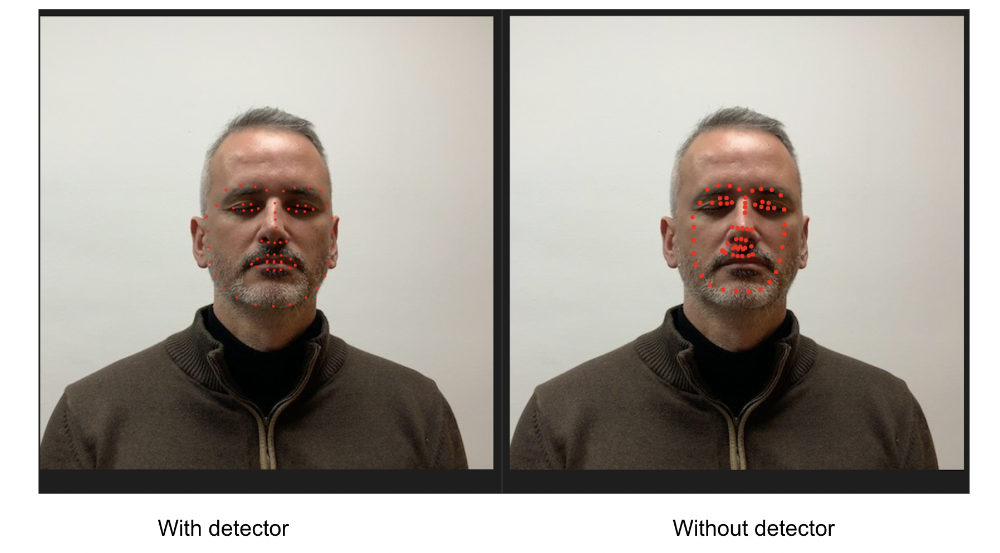

# DAD-3DHeads: A Large-scale Dense, Accurate and Diverse Dataset for 3D Head Alignment from a Single Image

#### Please refer to [original readme](https://github.com/PinataFarms/DAD-3DHeads/blob/main/README.md) of the repo to setup the DAD-3DHeads. I have modified this read for my work

### Introduction

I intended to use DADNet for dense 2D landmark detection. It performs well on DAD-3DHeads dataset but performance deteriorates when face is only a part of the image. Check Demo section. I used mediapipe facial detector and then passed the detected face to DADNet. The predicted 2D landmarks are then projected back on the original image. See demo section for details

### Installation

* Step1: Set up DADNet using the intructions [here](https://github.com/PinataFarms/DAD-3DHeads/blob/main/README.md#installation) 
* Step2: pip install mediapipe (pip install mediapipe-silicon for mac silicon)

### Demo

Check [this notebook](https://github.com/raja-kumar/DAD-3DHeads/blob/lmks_with_detector/mediapipe_dadnet_cleaned.ipynb)

